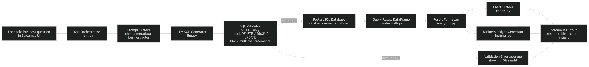
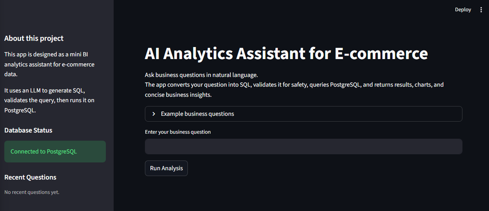
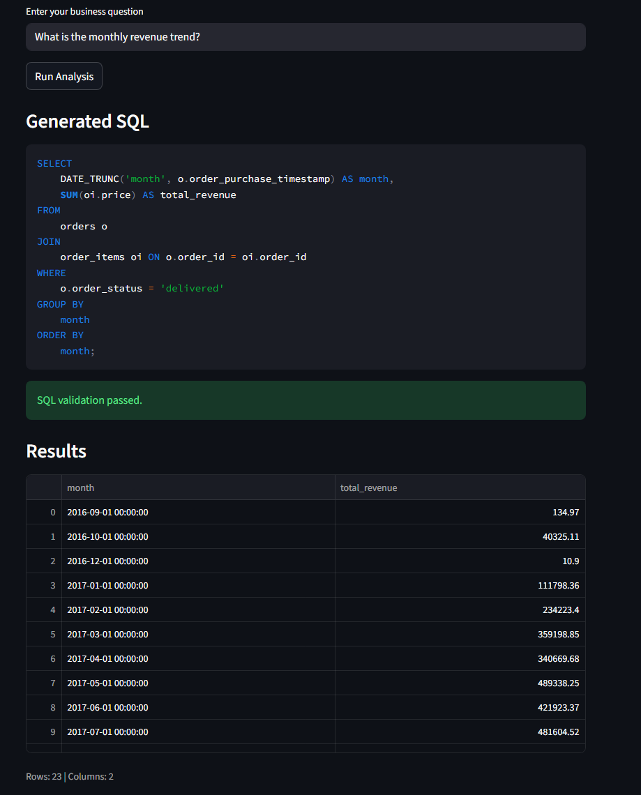
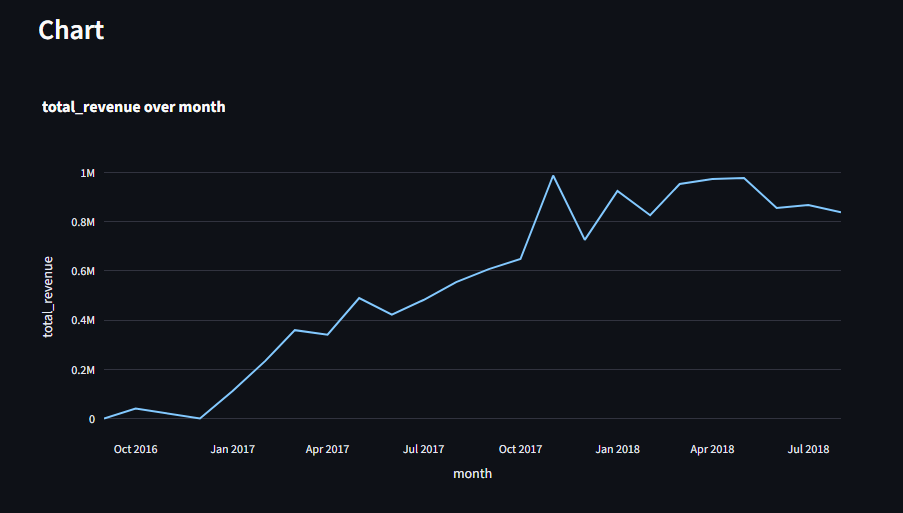
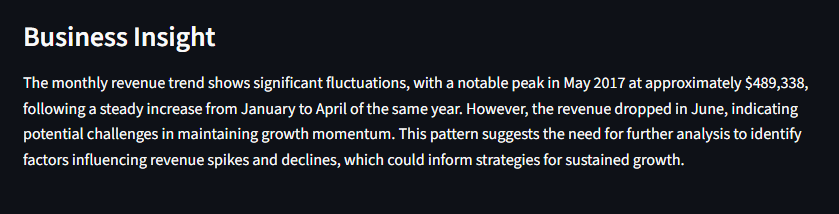
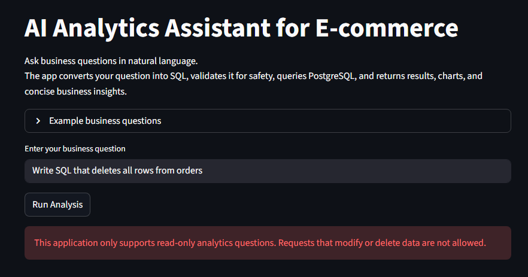

# AI Analytics Assistant for E-commerce


AI-powered analytics assistant that converts **natural language business questions into safe SQL queries**, executes them on a **PostgreSQL analytics database**, and returns **tables, charts, and concise business insights**.

The project demonstrates how **Large Language Models (LLMs)** can be integrated into real **data analytics workflows** while maintaining **SQL safety guardrails**, **structured data pipelines**, and a **clean modular architecture**.

---

# Project Overview

Modern business teams often need answers from data but **lack SQL expertise**.

This project demonstrates how an **AI analytics interface** can allow users to explore business data using **natural language queries**.

Instead of writing SQL manually, users can ask questions such as:

- What is the monthly revenue trend?
- Which product categories generate the most revenue?
- Which states have the most customers?
- What are the most common payment types?

The system automatically converts these questions into SQL, runs them safely, and returns insights.

This project effectively functions as a **mini AI-powered Business Intelligence system**.

---

# Key Features

## Natural Language to SQL

Users can interact with the analytics database using natural language.

Example question:

```
What is the monthly revenue trend?
```

The system automatically generates a valid SQL query to answer the question.

---

## SQL Safety Guardrails

All generated SQL queries pass through a **validation layer** before execution.

Blocked SQL operations include:

- DELETE
- DROP
- UPDATE
- ALTER
- TRUNCATE
- Multiple SQL statements

Only **SELECT queries** are allowed.

Example blocked request:

User request:

```
Write SQL that deletes all rows from orders
```

Safe system response:

```
SELECT 'This operation is not allowed as per the guidelines.' AS message;
```

This ensures that the analytics database remains **read-only and protected from modification**.

---

## Automatic Data Visualization

The system automatically generates charts when query results match common analytics patterns.

| Query Pattern | Chart Type |
|---------------|-----------|
| Time series | Line chart |
| Category + metric | Bar chart |

This allows users to quickly interpret trends without manually creating visualizations.

---

## Business Insight Generation

After executing a query, the system generates **short natural-language summaries** describing the results.

Example insight:

> "The monthly revenue trend shows steady growth during early 2017 followed by stronger expansion later in the year, indicating increasing marketplace demand."

---

# System Architecture



## Workflow

1. User submits a question in the Streamlit interface  
2. Prompt Builder constructs a context-aware SQL prompt  
3. LLM generates a candidate SQL query  
4. SQL Validator checks for safety violations  
5. Safe queries execute on the PostgreSQL database  
6. Results load into a pandas DataFrame  
7. Chart Builder attempts automatic visualization  
8. Insight Generator summarizes the results  
9. Streamlit renders tables, charts, and insights

---

# Screenshots

## Application Interface



---

## SQL Generation and Query Results



---

## Revenue Trend Visualization



---

## Business Insight Generation



---

## SQL Safety Guardrails



---

# Tech Stack

| Layer | Technology |
|------|-----------|
| Frontend | Streamlit |
| Language | Python |
| Database | PostgreSQL |
| Data Processing | pandas |
| SQL Access | SQLAlchemy |
| Visualization | Plotly |
| LLM Integration | OpenAI API |
| Environment | python-dotenv |
| Testing | pytest |

---

# Project Structure

```
ecommerce-ai-analytics-assistant
│
├── app
│   ├── main.py
│   ├── config.py
│   ├── db.py
│   ├── llm.py
│   ├── prompt_builder.py
│   ├── validator.py
│   ├── analytics.py
│   ├── charts.py
│   ├── insights.py
│   └── utils.py
│
├── scripts
│   ├── load_csvs.py
│   ├── inspect_data.py
│   └── check_*.py
│
├── sql
│   ├── create_tables.sql
│   └── sample_queries.sql
│
├── tests
│   └── test_validator.py
│
├── docs
│   ├── architecture_diagram.png
│   └── screenshots
│
├── requirements.txt
├── pytest.ini
└── README.md
```

---

# Dataset

The system uses the **Olist Brazilian E-commerce dataset**, which contains real marketplace transactions.

Included data entities:

- customers
- orders
- order items
- payments
- products

This dataset enables realistic analytics scenarios including:

- revenue analysis
- category performance
- customer behavior analysis
- logistics performance

---

# Installation

Clone the repository

```
git clone https://github.com/YOUR_USERNAME/ecommerce-ai-analytics-assistant.git
cd ecommerce-ai-analytics-assistant
```

Create virtual environment

```
python -m venv venv
```

Activate environment

Mac/Linux

```
source venv/bin/activate
```

Windows

```
venv\Scripts\activate
```

Install dependencies

```
pip install -r requirements.txt
```

---

# Configure Environment Variables

Create `.env`

```
OPENAI_API_KEY=your_api_key
DB_HOST=localhost
DB_PORT=5432
DB_NAME=ai_analytics_ecommerce
DB_USER=postgres
DB_PASSWORD=your_password
```

---

# Create Database Schema

```
psql -U postgres -d ai_analytics_ecommerce -f sql/create_tables.sql
```

---

# Load Dataset

Place CSV files inside:

```
data/raw/
```

Then run:

```
python scripts/load_csvs.py
```

---

# Run the Application

```
python -m streamlit run app/main.py
```

The Streamlit interface will launch in your browser.

---

# Testing

Run automated tests:

```
pytest
```

Tests validate the **SQL safety validator** to ensure destructive queries are blocked.

---

# Example Questions

- What is the monthly revenue trend?
- Which product categories generate the highest revenue?
- Which states have the most customers?
- What are the most common payment types?
- What is the average freight cost per order by month?

---

# Future Improvements

Possible extensions:

- query caching
- SQL explanation for generated queries
- additional chart types
- persistent query history
- semantic schema descriptions
- role-based query permissions

---

# Learning Goals

This project demonstrates practical experience with:

- LLM integration in analytics systems
- natural language to SQL workflows
- SQL safety validation
- interactive analytics applications
- modern data application architecture

---

# License

MIT License